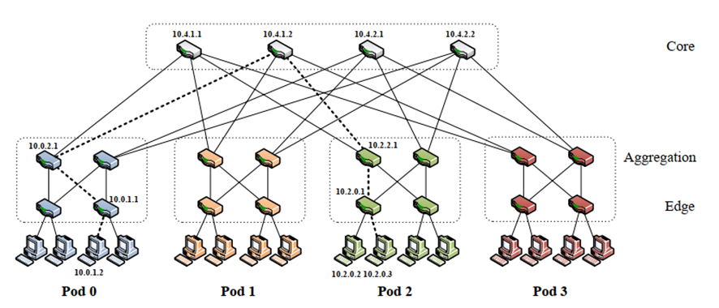

# Mininet-Topology-Simulation
Final Project for CMPE 252 building Clos tree, Jellyfish, and S2 networking topologies.

CMPE 252A Final Project
By Justin Lee & Pranav Yerabati

## Project Description
Our project simuates two routing algorithms; Dijkstra's algorithm and ECMP (Equal Cost Multiple Paths), in a virtual Software-Defined Network topology. It creates a Fattree network (with K=4) using the [Mininet network simulator](http://mininet.org/), and uses the Python based [Pox SDN controller](http://www.brianlinkletter.com/using-the-pox-sdn-controller/). If mininet is used as a virtual machine, it needs to be configured such that SSHing from the host machine to the virtual machine is possible, which is decribed [here](http://mininet.org/vm-setup-notes/). Also, the academic paper on the Fattree network topology which we tried to recreate can be found [here](http://ccr.sigcomm.org/online/files/p63-alfares.pdf). 

# Instructions to Run

Our project requires two separate shell console windows to run; one for the controller and one for the network topology (mininet). Our project requires 4 bash scripts to run; 2 for the controller and 2 for the network topology. These bash scripts are located in the scripts directory:

Controller Bash Scripts:
- controller_dij.sh
- controller_ecmp.sh

Network Topology (Mininet) Bash Scripts:
- run_dij.sh
- run_ecmp.sh

## To test Dijkstras:
- On one shell, run: sudo sh controller_dij.sh
- On the other, run: sudo sh run_dij.sh

## To test ECMP
- On one shell, run: sudo sh controller_ecmp.sh
- On the other, run: sudo sh run_ecmp.sh

Iperf was used to generate traffic through the network, and its output will be saved in lib/results/fattree-{dij/ecmp}/{input-file-name}/data

# Network Topology Plot
We provided a plot we have generated using the python library matplotlib to plot our fat-tree topology. The file is named fattree_topo.png:

# Project Summary

The goal of this final project was to implement a simulation of a  Fat Tree / Clos topology for a data center network in Mininet with various routing protocols. We build a software defined networking (SDN) network using simulated switches with an SDN controller. The main structure of the code was designed based on Ripl-POX (https://github.com/brandonheller/riplpox, a library for POX). Our public repository for this project can be found at Topology-mini (https://github.com/lejuste/Topology-mini). 

The first part of the project was to contract a fat tree topology with (k=4) fat-tree topology. We built the topology in DCTopo.py based on the fat tree topology in ripl-master (https://github.com/brandonheller/ripl). This was built in mininet.

The second part was to run Dijkstra’s algorithm between two pairs of end hosts. We first built the algorithm that takes in a nested dictionary list that holds all nodes and every connected node to that given node. 

For the third part, we attempted to implement two-level routing algorithms proposed to improve the link bandwidth. However were unable to implement the two flows tables required. 

The fourth step of the project was to implement ECMP which uses a hash function to pick a given path through the fat tree network topology from the k different paths. We implemented this by running dijkstras on a graph object that only had one specific available core switch that is chosen with a hash function which his run by combining any source and destination ip pair. 

Finally, we built a separate script to evaluate each routing scheme using Iperf and the given traffic patterns. 

In conclusion, we spent multiple weeks and countless hours adding functions and modifying the provided skeleton code. We really enjoyed understanding how to create a given topology and use a SDN controller. 

# Known Issues/Errors

1. Iperf Connection Failed: This is seen some times as the output for the iperf client, however we believe it must be due to how iperf not closing the connection properly. We tested multiple times by opening xterm windows on those hosts, and we were not able to find an error. 

2. We were not able to call the controller in mn_ft.py, as the switches would not connect. Therefore we implemented own own bash scripts to run the controller and mininet in separate shell windows. 

3. Messy result files.
